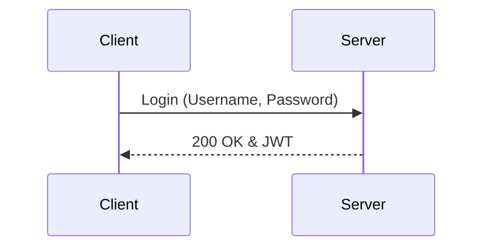
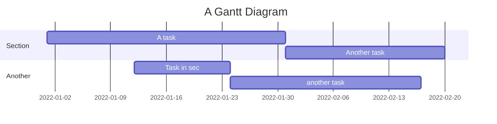

# Mermaid

## [Text-Based Entity Relationship Diagrams with Mermaid.js](https://newdevsguide.com/2023/04/08/creating-erds-with-mermaid/)

## [Sequence Diagrams in Markdown with Mermaid.js](https://newdevsguide.com/2023/04/10/mermaid-sequence-diagrams/)

## [Drawing graphs in GitHub comments with Mermaid diagrams](https://andrewlock.net/drawing-graphs-in-github-comments-with-mermaid-diagrams/)

> How I managed to draw graphs in GitHub PR comments using Mermaid diagrams!
> none of these are the bar or line charts that I really wanted. So some imagination was necessary.

##### Hacking mermaid diagrams to produce bar charts
...

---

### [Adding Diagrams and visualizations in your Azure DevOps wiki using Mermaid](https://dailydotnettips.com/adding-diagram-and-visualizations-in-your-azure-devops-wiki-using-mermaid/)

[Search Triple Collon issue](https://search.brave.com/search?q=azure+wiki+Markdown+triple+colon&source=web), issue [6727](https://github.com/MicrosoftDocs/azure-devops-docs/issues/6717)

You can take the help of Mermaid Live Editor generates a real-time Mermaid diagram and then the code block to your wiki pages for faster results.

https://mermaid-js.github.io/mermaid/#/README

### Graph

- See :fa-github: blog [Include diagrams in your Markdown files with Mermaid](https://github.blog/2022-02-14-include-diagrams-markdown-files-mermaid/)
- [another example](https://gist.github.com/martinwoodward/8ad6296118c975510766d80310db71fd)

### [GitHub Diagrams with Mermaid](https://ardalis.com/github-diagrams-with-mermaid/) ^^by Ardalis^^

**Types of diagram** you're creating on the first line. Some examples include:

- classDiagram
- erDiagram
- flowchart
- gantt
- graph
- journey
- pie
- requirementDiagram
- sequenceDiagram
- stateDiagram-v2

the syntax is not consistent between types,