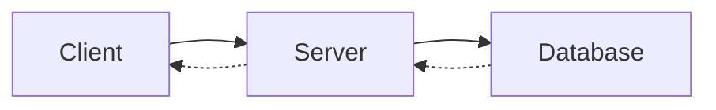
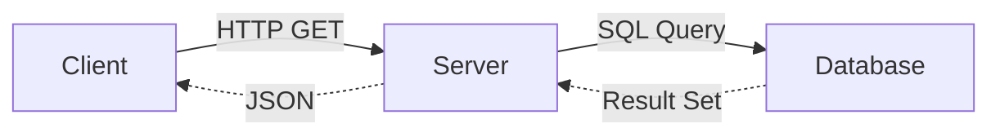
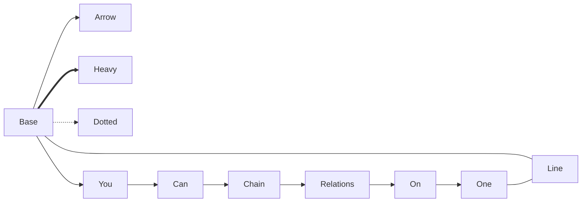
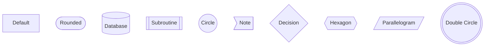
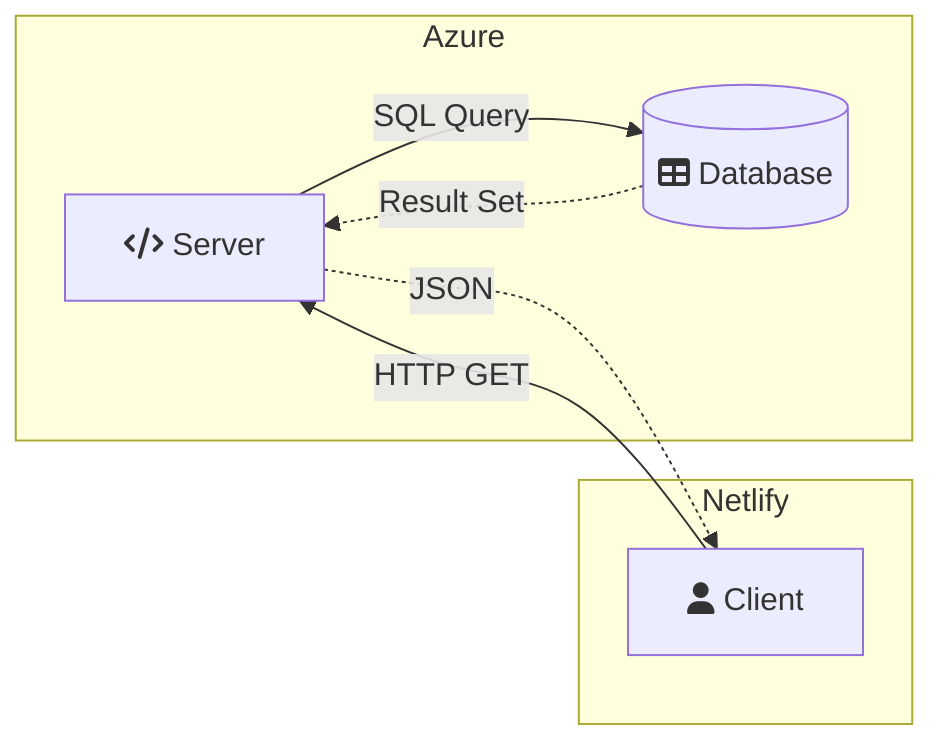

# Flowchart
- [Matt Eland's Flow example](https://newdevsguide.com/2023/04/15/mermaid-flowcharts/)

> building out a simple flowchart illustrating a REST request that flows from the client to the server, is fulfilled by the database, and then returns back to the client.

### Relationships
```
    Client --> Server
    Server --> Database
```

**Connection Shapes**
- `-->` solid line
- `-.->` to represent a dotted arrow

**Left to Right**: `flowchart LR`

# multiple connections to each shape



# Aliases and Labels
- `c[Client]`
- `c -- HTTP GET --> s`



# Additional Connector Types
- Arrow, Heavy, Doted, Line
-  Also, **multiple relationships** in a single line via **chaining**



# Flowchart Shapes


# Subgraphs
- with two font-awesome icons, `fa:fa-code Server` & `fa:fa-user Client`


