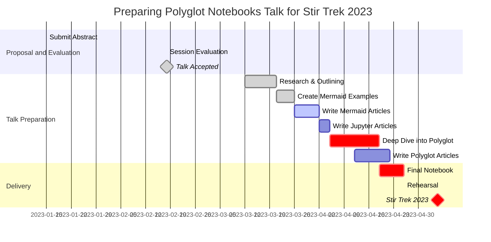

# Gantt Chart
- [Matt Eland's Gantt Chart example](https://newdevsguide.com/2023/04/14/mermaid-gantt-chart/)

> Gantt charts are **project management charts** named after their creator, Henry Gantt in the early 1900's.
> used to document **key dates** and **phases** in projects by rendering boxes starting at a task's start date and ending at that task's end date.
> Helpfull for finding the __critical path__
> To a large degree, Agile has replaced Gantt Charts

### Format
```
task name : start-date, end-date
```

### custom statuses

- **done** for completed tasks
- **active** for tasks currently in progress
- **crit** for tasks on the critical path
- **milestone** for milestones (see next section)

**Example**
```
Create code for Gantt chart     :done, crit,   2023-04-11, 2d
```

### Sections and Milestones

### Relative Scheduling of Tasks
- simulating a predecessor relationship.
- To help differentiate between valid statuses such as **done** and **active**, I like to use **uppercase identifiers** like **OUTLINE**.

### Compact Mode and Date Line
- a red "today line" at the current date 
- `displayMode` to `compact`

# Kitchen Sink Example

