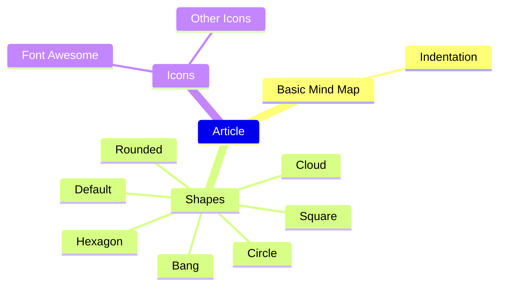
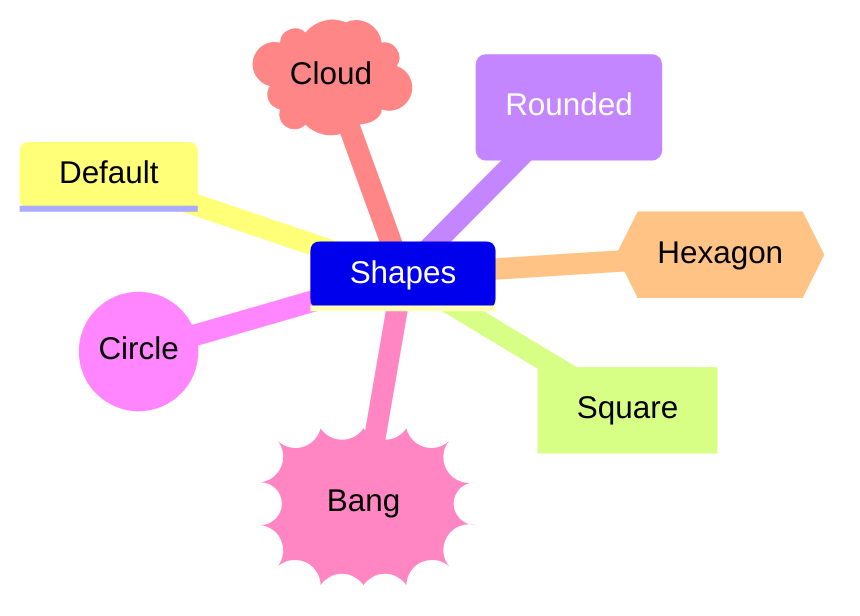

# Mind Maps

[Mind Maps example](https://newdevsguide.com/2023/04/14/mermaid-mind-maps/)


Basic Mind Maps in Mermaid.js
At their core, **mind maps are just outlines** and so the markdown for them is very similar to an outline:



### Different Shapes 


Mermaid.js allows you to add in icons from vectorized libraries like Font Awesome through specifying a few classes.

```
mindmap
    Talk
    ::icon(fa fa-microphone)
        Notebooks
        ::icon(fa fa-book)
        Jupyter Notebooks
        ::icon(fa fa-rocket)
            IDEs
            ::icon(fa fa-code)
            Anaconda
            ::icon(fa fa-file-code)
        Polyglot Notebooks
        ::icon(fa fa-pencil)
            Installation
            ::icon(fa fa-wrench)
            Languages
            ::icon(fa fa-comment)
            Variable Sharing
            ::icon(fa fa-share)
        Next Steps
        ::icon(fa fa-arrow-right)
```

