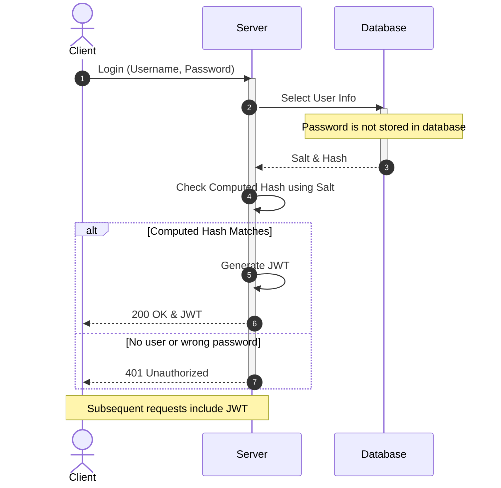

# SD

```mermaid
sequenceDiagram
    autonumber
    actor C as Client
    participant S as Server
    participant DB as Database
    C->>S: Login (Username, Password)
    activate S
        S->>DB: Select User Info
        
        activate DB
            note over DB: Password is not stored in database
            DB-->>S: Salt & Hash
        deactivate DB

        S->>S: Check Computed Hash using Salt
        alt Computed Hash Matches
            S->>S: Generate JWT
            S-->>C: 200 OK & JWT
        else No user or wrong password
            S-->>C: 401 Unauthorized
        end
    deactivate S
    note over C, S: Subsequent requests include JWT
```

---

### end 