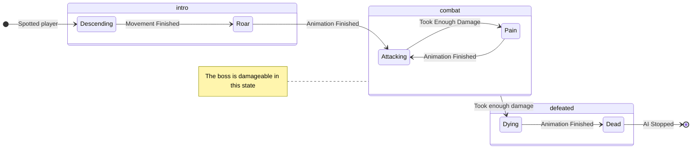

# State Diagram
- [Matt Eland's Diagramming Finite State Machines](https://newdevsguide.com/2023/04/18/mermaid-state-machine/)

```mermaid
stateDiagram-v2
    direction LR

    state intro {
        Descending --> Roar : Movement Finished
        Roar --> Attacking  : Animation Finished
    }
    state combat {
        Attacking --> Pain  : Took Enough Damage
        Pain --> Attacking  : Animation Finished
    }
    state defeated {
        Dying --> Dead      : Animation Finished
    }

    [*] --> Descending      : Spotted player
    combat --> Dying        : Took enough damage
    Dead --> [*]            : AI Stopped

    note left of combat: The boss is damageable in this state
```
