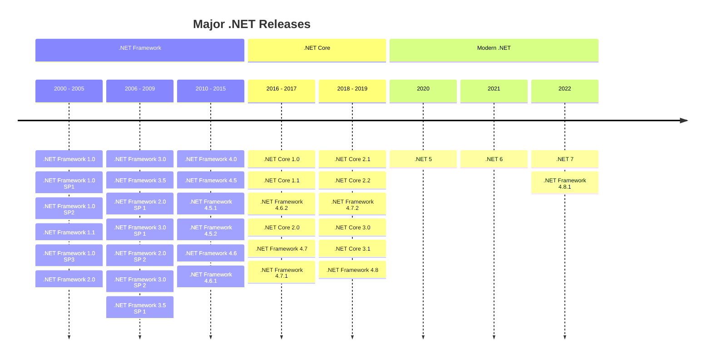

# Timeline Charts
- [Matt Eland's Timeline Chart example](https://newdevsguide.com/2023/04/16/mermaid-timeline-charts/)

[Gantt Carts](https://newdevsguide.com/2023/04/14/mermaid-gantt-chart/) can be great for detailed task analysis, but sometimes you just want to look at a high-level view of what's going on in a time period. Mermaid.js gives us **Timeline Charts** to help with that.

### the process of building this chart, step by step.

JKM: how would I do this to express [MHB Timeline](https://myhebrewbible.com/List/TimeLine)

1. Defining Time Ranges
> I would need to figure out how to do this differentiating between BC and AD

2. Adding Timeline Entries
> [MHB Favorite Verses](http://www.myhebrewbible.com/FavoriteVerses) 

3. Adding Sections to our Timeline Chart
You can group together multiple columns into a section to help convey meaning or relationships.

> Bc,Ad, before divorce, during divorce, after redemption 

4. Adding a Title

#### Marsing’s Insight 

A brief introduction why my take on this whole thing is unique and hopefully powerful. Point to page one of 
my website as an example to get better understanding. A great source for a timeline would be the table of 
contents I created for my favorites list source 

> Source [Exegesis Timeline #796](https://myhebrewbible.com/Article/796/Exegesis-Timeline)
