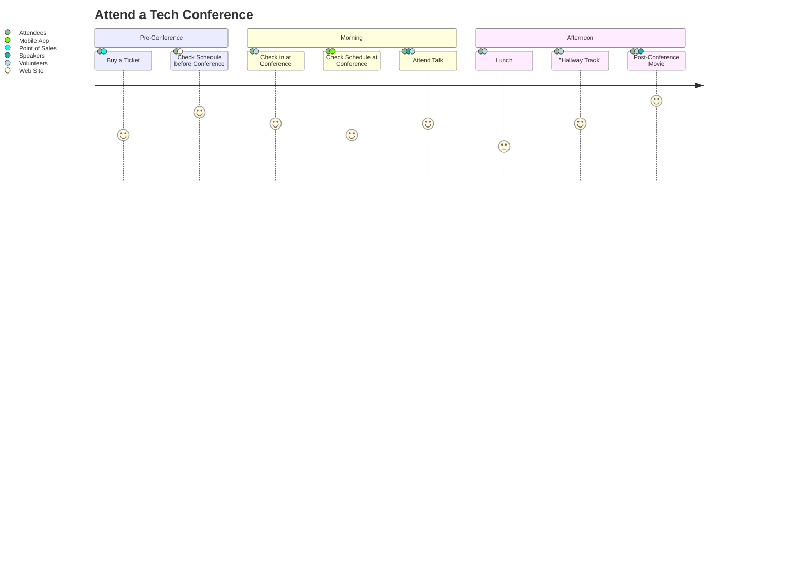

# `journey`
- [Matt Eland's User Journey example](https://newdevsguide.com/2023/04/12/user-journey-maps-mermaid/)

```mermaid
journey
    title Attend a Tech Conference
    section Pre-Conference
        Buy a Ticket: 4: Attendees, Point of Sales
        Check Schedule before Conference: 6: Attendees, Web Site
    section Morning
        Check in at Conference: 5: Attendees, Volunteers
        Check Schedule at Conference: 4: Attendees, Mobile App    
        Attend Talk: 5: Attendees, Speakers, Volunteers
    section Afternoon
        Lunch: 3: Attendees, Volunteers
        "Hallway Track": 5: Attendees, Volunteers
        Post-Conference Movie: 7: Attendees, Volunteers, Speakers
```
