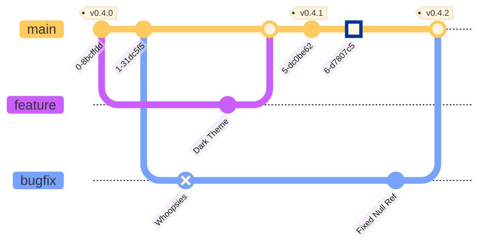

# git Branching
- [Matt Eland's git Branching example](https://newdevsguide.com/2023/04/11/illustrating-git-branching-with-markdown-mermaid-js/)

# Kitchen Sink

```mermaid
%%{init: { 'theme': 'base' } }%%
gitGraph
    commit tag: "v0.4.0"
    branch feature
    checkout main
    commit
    branch bugfix
    commit id: "Whoopsies" type: REVERSE
    checkout feature
    commit id: "Dark Theme"
    checkout main
    merge feature
    commit tag: "v0.4.1"
    commit type: HIGHLIGHT
    checkout bugfix
    commit id: "Fixed Null Ref"
    checkout main
    merge bugfix tag: "v0.4.2"
```
