# Special Events

## Index
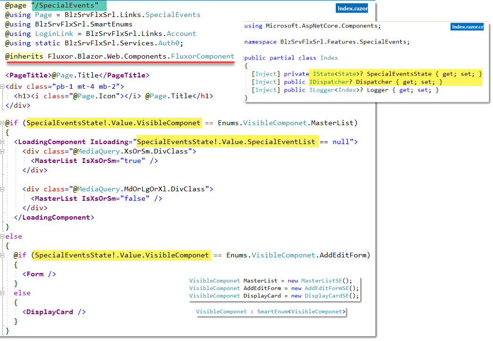

## MasterList Table (MdOrLgOrXL)
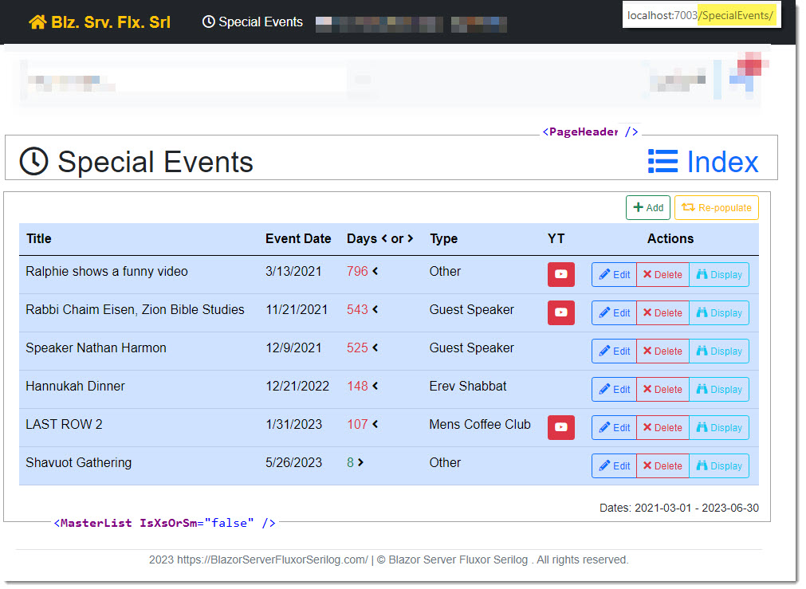

## MasterList ActionButtons
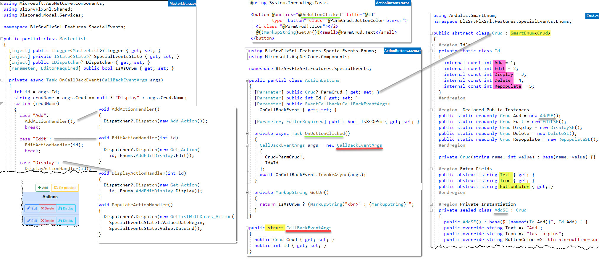

## MasterList XsOrSm Grid
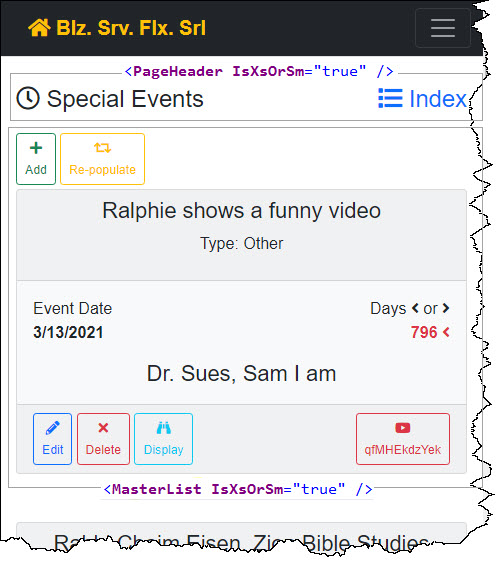

## Form
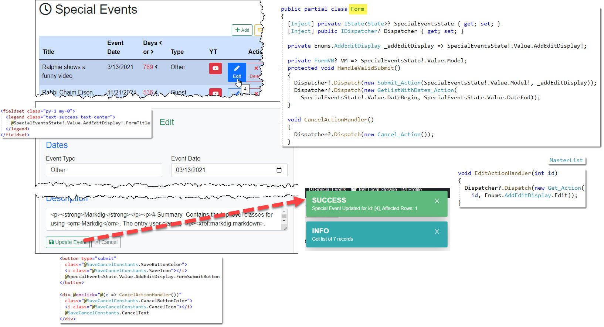

## DisplayCard
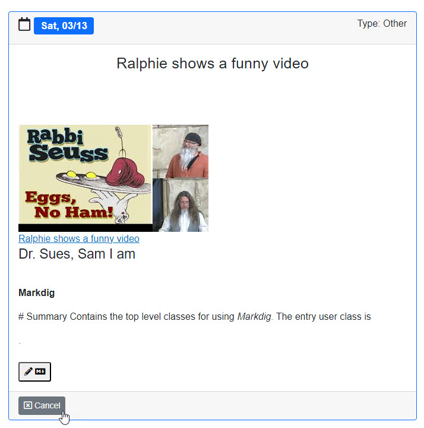

### DisplayCard razor
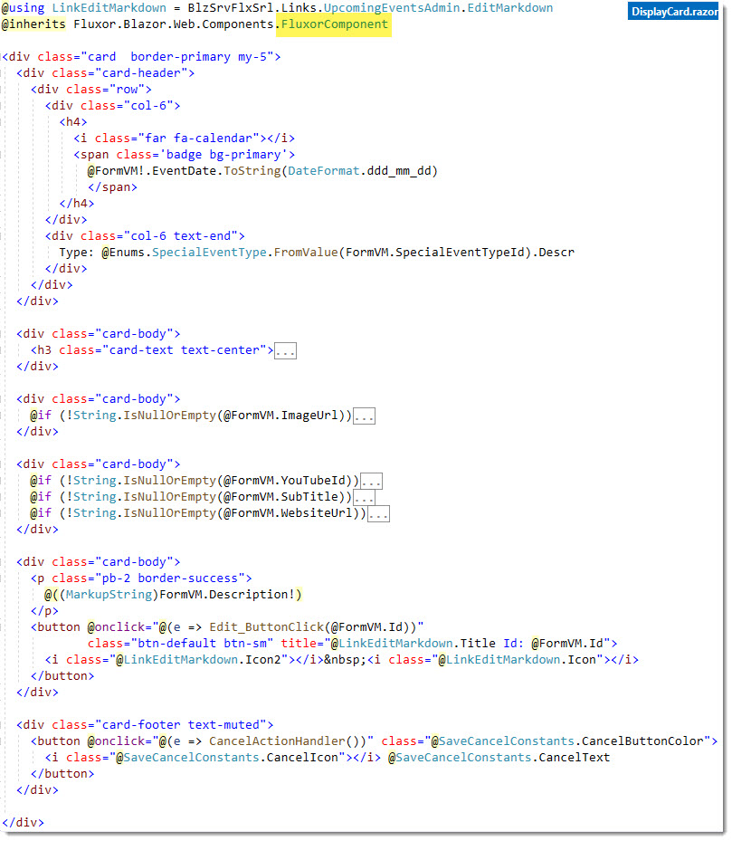

### DisplayCard code behind
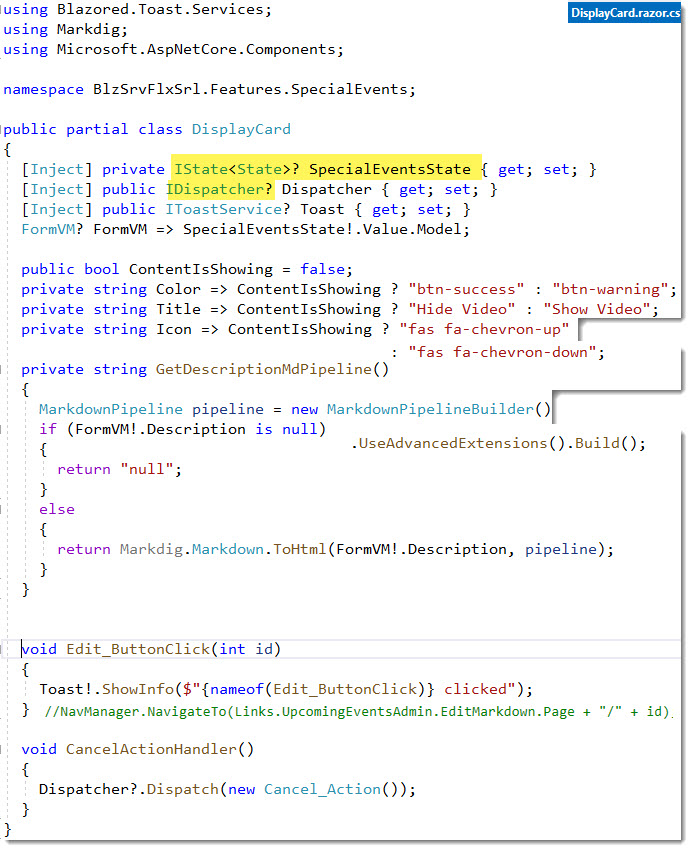

## Delete Modal
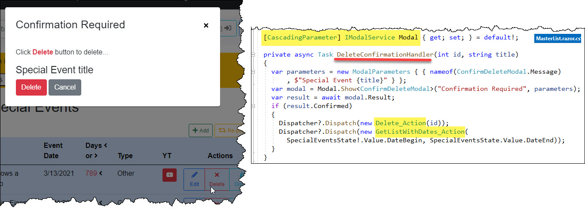

## Add / Edit / Display
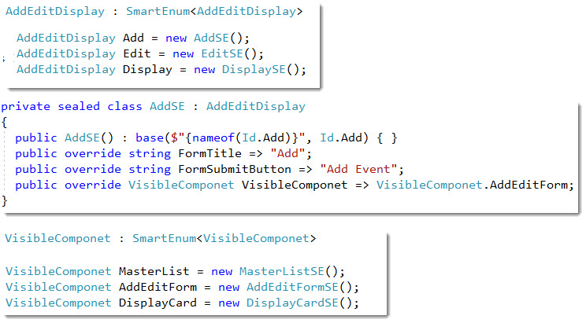

# Other

## `FormVM.cs`
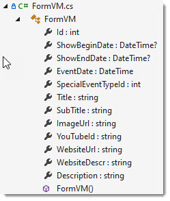

## `SaveCancelConstants`
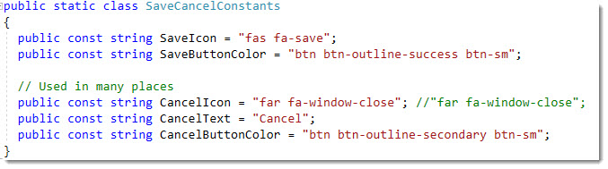

## `YouTubeButton.razor` Component
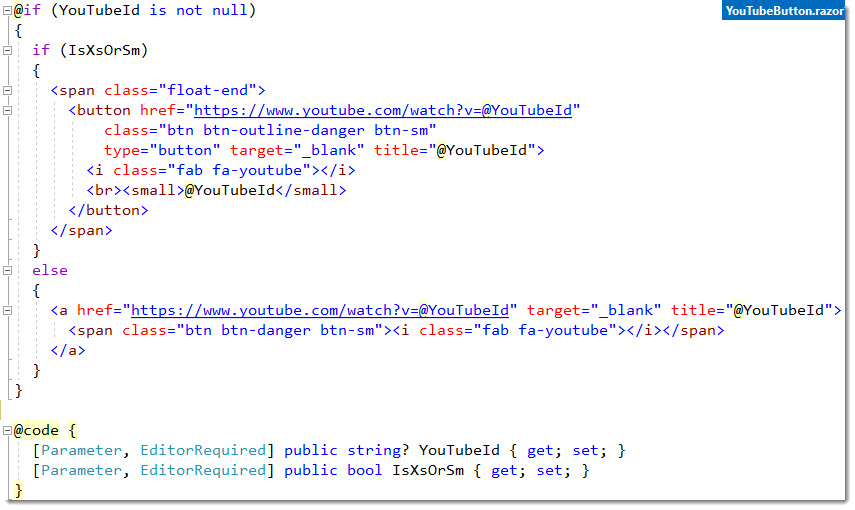