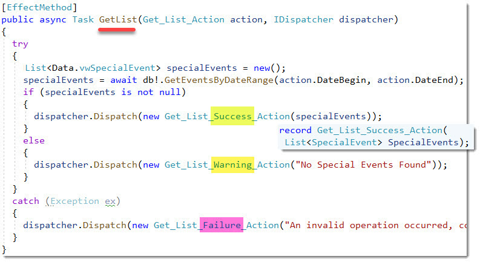
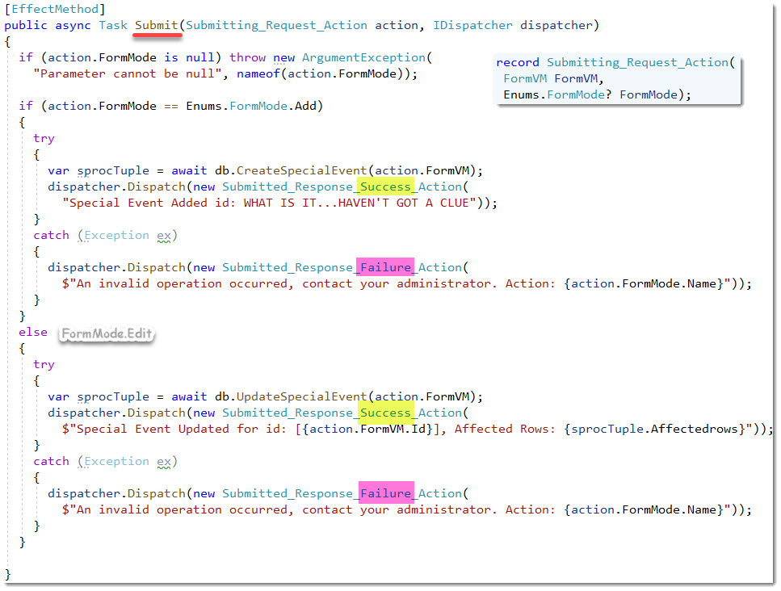
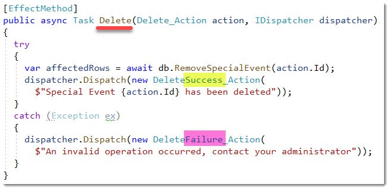
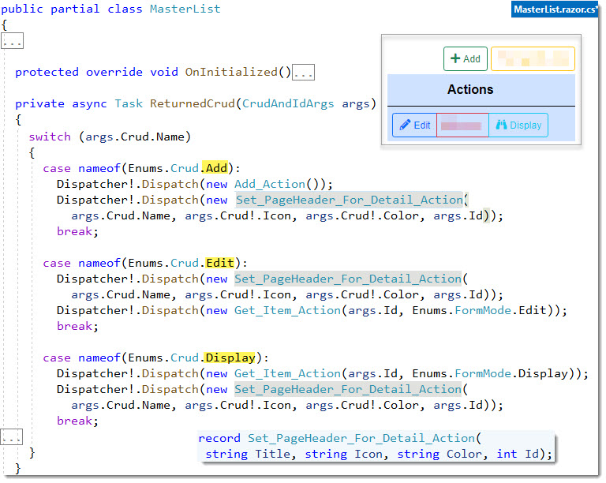
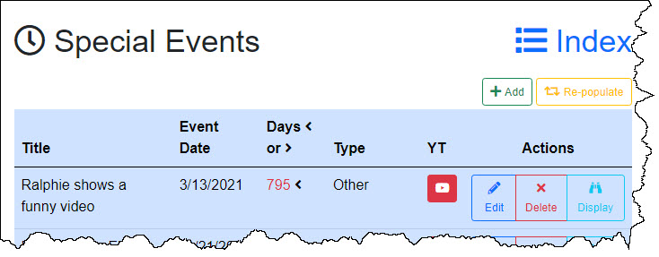
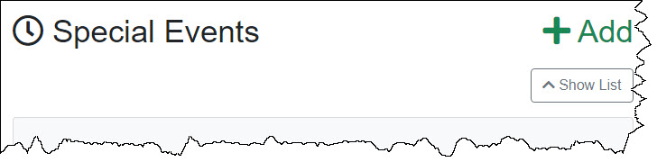
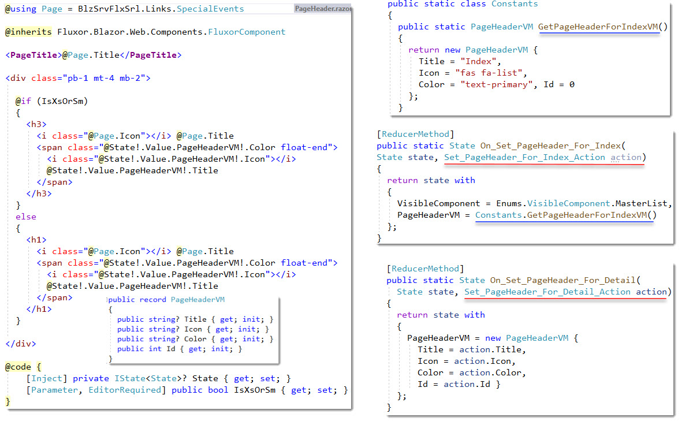

# Special Events MasterList / Detail component
- This uses Vertical Slice Architecture and the folder that this component lives is **SpecialEvents**
- On the [Living Messiah](https://LivingMessiah.com/) website there are normal weekly events that occur every week and periodically an extraordinary event occurs which needs to be shown on the website in a timely fashion.  The Special Event component keeps track of this types of events, see [Living Messiah](https://LivingMessiah.com/UpcomingEvents)

## Index Screen shot


## Index.razor.cs

**1.1 Get_List_...**

## `GetList()` 


## External References...

- Form.razor.cs
  - HandleValidSubmit 

- MasterList.razor.cs
  - OnInitialized if (SpecialEventsState!.Value.SpecialEventList is null) i.e.first time
  - ReturnedCrud case nameof(Enums.Crud.Delete)
  - ReturnedCrud case Repopulate


**1.2 Get_Item_...**
**Get_Item_Action**


## `GetItem()` 


**1.3 Actions related to Form Submission**
## `Submit()` 



**1.5 Actions related deletions**
## `Delete()` 



**1.6 PageHeader actions**

## `MasterList!ReturnedCrud()` 

#### CallBack example
```razor
<ActionButtons 
	OnCrudActionSelected="@ReturnedCrud" 
	ParmCrud="Enums.Crud.Add" 
	IsXsOrSm="@IsXsOrSm" 
	Id="0" />
```

```csharp
	private async Task ReturnedCrud(CrudAndIdArgs args)
	{
		switch (args.Crud.Name)
		{
			case nameof(Enums.Crud.Add):
				Dispatcher!.Dispatch(new Add_Action());
				Dispatcher!.Dispatch(new Set_PageHeader_For_Detail_Action(args.Crud.Name, args.Crud!.Icon, args.Crud!.Color, args.Id));
				break;
// ...				
```



Transition from...


Transition to...


# SpecialEvents folder

## `Index.razor`
like all `Index.razor` files this is no different in that it contains and orchestrates other components. It passes down to them Media Query info (`IsXsOrSm`) and based on the value of the `VisibleComponent` determines what component to show.

#### contained components
 1. `PageHeader` 
 2. `MasterList`
 3. `ShowMasterIndex`
 4. `Form`
 5. `DisplayCard`

## `Index.razor` 


## 1. `PageHeader.razor.cs`
PageHeader shows the top section of the Index page along with some dynamic content that shown on the right. It contains the `<PageTitle />` component which is found in `Index.razor` components that have the `@page` directive.  

The markup that's on the right side is dynamic based on the values found in `PageHeaderVM`. `PageHeaderVM` gets changed based on the Fluxor actions `Set_PageHeader_For_Index_Action` or `Set_PageHeader_For_Detail_Action`.  

The **Index** action is the same and populates the VM by calling `Constants.GetPageHeaderForIndexVM()`  The **Detail** is dependent on the results of **MasterList!ReturnedCrud**



## 2. MasterList Table (MdOrLgOrXL)
- MdOrLgOrXL i.e. `IsXsOrSm="false"`

ToDo: add <TableTemplate>

## MasterList ActionButtons


## `MasterList` XsOrSm Grid
- `IsXsOrSm="true"`


## Form


## 05 `DisplayCard`


### DisplayCard razor


### DisplayCard code behind


## Delete Modal


## Add / Edit / Display


# Other

## `FormVM.cs`


## `SaveCancelConstants`


## `YouTubeButton.razor` Component


# `FluxorStore.cs`


## 1. Actions
```csharp
// 1.1 GetList() actions
public record Get_List_Success_Action(List<Data.vwSpecialEvent> SpecialEvents);
public record Get_List_Success_Action(List<SpecialEvent> SpecialEvents);  
public record Get_List_Warning_Action(string WarningMessage);             
public record Get_List_Failure_Action(string ErrorMessage);               

// 1.2 GetItem() actions
public record Get_Item_Action(int Id, Enums.FormMode? FormMode);               

public record Get_Item_Success_Action(FormVM? FormVM); 
  public record Edit_Action(int Id);    // FormMode == FormMode.Edit
  public record Display_Action(int Id); // FormMode != FormMode.Edit

public record Get_Item_Warning_Action(string WarningMessage);     
public record Get_Item_Failure_Action(string ErrorMessage);       

// 1.3 Actions related to Form Submission 
public record Submitting_Request_Action(FormVM FormVM, Enums.FormMode? FormMode);  
public record Submitted_Response_Success_Action(string SuccessMessage); 
public record Submitted_Response_Failure_Action(string ErrorMessage);   

// 1.4 Actions related to the MasterList (specifically the ActionButtons!EventCallback)
public record Add_Action();           

// 1.5 Delete() actions
public record Delete_Action(int Id);
public record DeleteSuccess_Action(string SuccessMessage);  
public record DeleteFailure_Action(string ErrorMessage);    


// 1.6 PageHeader actions
public record Set_PageHeader_For_Index_Action(PageHeaderVM PageHeaderVM);
public record Set_PageHeader_For_Detail_Action(
        string Title, string Icon, string Color, int Id);

```


## 2. State
```csharp

public record State
{
  public DateTimeOffset? DateBegin { get; init; }
  public DateTimeOffset? DateEnd { get; init; }
  public Enums.VisibleComponent? VisibleComponent { get; init; }
  public Enums.FormMode? FormMode { get; init; }
  public string? SuccessMessage { get; init; }
  public string? WarningMessage { get; init; }
  public string? ErrorMessage { get; init; }
  public FormVM? FormVM { get; init; }
  public List<Data.vwSpecialEvent>? SpecialEventList { get; init; }
  public PageHeaderVM? PageHeaderVM { get; init; }
}
```

## 3. Feature  
```csharp
public class FeatureImplementation : Feature<State>
{
  public override string GetName() => "SpecialEvents"; // You have to put something here???

  protected override State GetInitialState()
  {
    return new State
    {
      DateBegin = DateTime.Parse(Constants.DateRange.Start),
      DateEnd = DateTime.Parse(Constants.DateRange.End),
      FormMode = null,
      VisibleComponent = Enums.VisibleComponent.MasterList,
      SuccessMessage = string.Empty,
      WarningMessage = string.Empty,
      ErrorMessage = string.Empty,
      PageHeaderVM = Constants.GetPageHeaderForIndexVM(),
      FormVM = new FormVM()
    };
  }
}
```

## 4. Reducers
```csharp
`public static class Reducers`
```


**Get_List_Success_Action**
```csharp
VisibleComponent = Enums.VisibleComponent.MasterList,
WarningMessage = string.Empty,
ErrorMessage = string.Empty,
SpecialEventList = action.SpecialEvents
```

**Get_List_Warning_Action**
```csharp
VisibleComponent = Enums.VisibleComponent.MasterList,
WarningMessage = action.WarningMessage
```

**Get_List_Failure_Action action**
```csharp
ErrorMessage = action.ErrorMessage
```

**Get_Item_Success_Action action**
FormVM = action.FormVM

**Get_Item_Failure_Action**
```csharp
VisibleComponent = Enums.VisibleComponent.MasterList,
ErrorMessage = action.ErrorMessage
```

**Submitting_Request_Action**
```csharp
FormMode = action.FormMode
```

**On_Submitted_Response_Success**
```csharp
VisibleComponent = Enums.VisibleComponent.MasterList,
SuccessMessage = ""
```

**Submitted_Response_Failure_Action**
```csharp
ErrorMessage = action.ErrorMessage,
VisibleComponent = Enums.VisibleComponent.MasterList
```

**Add_Action**
```csharp
VisibleComponent = Enums.VisibleComponent.AddEditForm,
FormMode = Enums.FormMode.Add,
FormVM = new FormVM()
```

**Edit_Action**
```csharp
VisibleComponent = Enums.VisibleComponent.AddEditForm,
FormMode = Enums.FormMode.Edit,
```

**Display_Action**
```csharp
VisibleComponent = Enums.VisibleComponent.DisplayCard
```

**Delete_Action**
```csharp
VisibleComponent = Enums.VisibleComponent.MasterList,
```

**Set_PageHeader_For_Index_Action**
```csharp
VisibleComponent = Enums.VisibleComponent.MasterList,
PageHeaderVM = Constants.GetPageHeaderForIndexVM()
```

**Set_PageHeader_For_Detail_Action**
```csharp
PageHeaderVM = new PageHeaderVM 
  { Title = action.Title, Icon = action.con, Color = action.Color, Id = action.Id }
```
