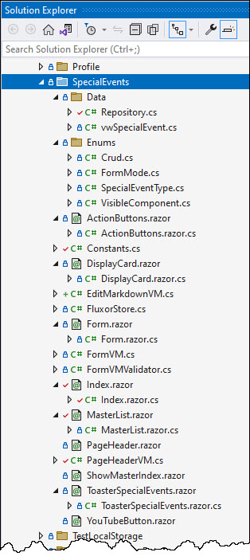
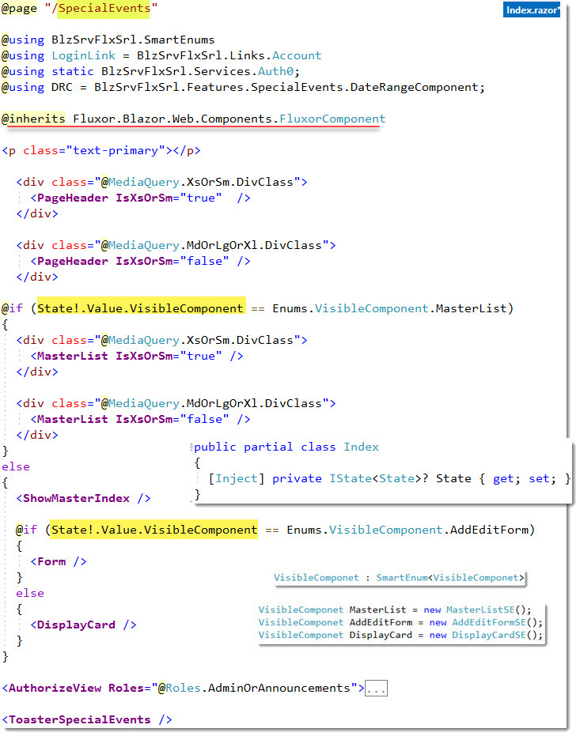
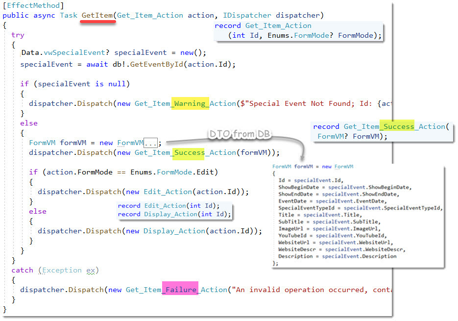
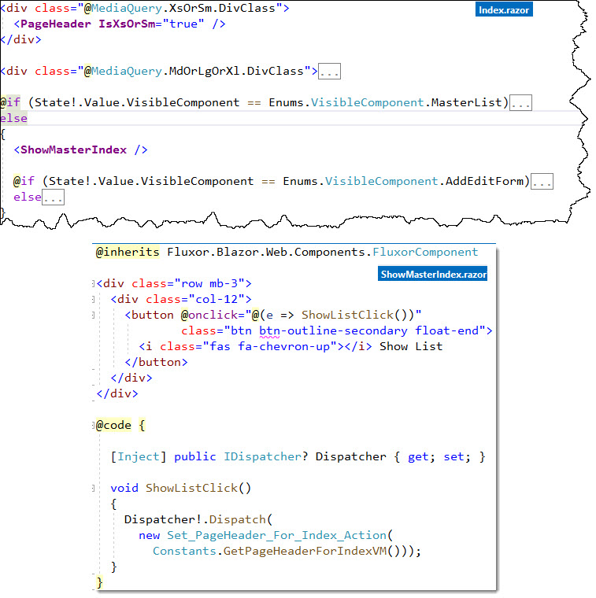
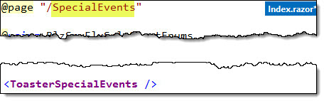

# Special Events MasterList / Detail component
- This uses Vertical Slice Architecture and the folder that this component lives is **SpecialEvents**
- On the [Living Messiah](https://LivingMessiah.com/) website there are normal weekly events that occur every week and periodically an extraordinary event occurs which needs to be shown on the website in a timely fashion.  The Special Event component keeps track of this types of events, see [Living Messiah](https://LivingMessiah.com/UpcomingEvents)

You could in theory, fairly easily I would think, swap out the MasterList and put in it's place a `BlazoredTypeahead` component or, instead of the TableTemplate in MasterList, use a Grid component

## Solution Explorer
- Inspired by Vertical Architecture




## Index Screen shot


## Index.razor.cs

Transition from...


Transition to...


# SpecialEvents folder

## `Index.razor`
like all `Index.razor` files this is no different in that it contains and orchestrates other components. It passes down to them Media Query info (`IsXsOrSm`) and based on the value of the `VisibleComponent` determines what component to show.

#### contained components
 1. `PageHeader` 
 2. `MasterList`
 3. `ShowMasterIndex`
 4. `Form`
 5. `DisplayCard`

## `Index.razor` 




## 1. `PageHeader.razor.cs`
PageHeader shows the top section of the Index page along with some dynamic content that shown on the right. It contains the `<PageTitle />` component which is found in `Index.razor` components that have the `@page` directive.  

The markup that's on the right side is dynamic based on the values found in `PageHeaderVM`. `PageHeaderVM` gets changed based on the Fluxor actions `Set_PageHeader_For_Index_Action` or `Set_PageHeader_For_Detail_Action`.  

The **Index** action is the same and populates the VM by calling `Constants.GetPageHeaderForIndexVM()`  The **Detail** is dependent on the results of **MasterList!ReturnedCrud**


## 2. MasterList Table (MdOrLgOrXL)
- MdOrLgOrXL i.e. `IsXsOrSm="false"`

ToDo: add <TableTemplate>

## MasterList ActionButtons


## `MasterList` XsOrSm Grid
- `IsXsOrSm="true"`


## Form


## 05 `DisplayCard`


### DisplayCard razor


### DisplayCard code behind


## Delete Modal


## Add / Edit / Display


# Other

## `FormVM.cs`


## `SaveCancelConstants`


## `YouTubeButton.razor` Component


# `FluxorStore.cs`


## 1. Actions
```csharp
// 1.1 GetList() actions
public record Get_List_Success_Action(List<Data.vwSpecialEvent> SpecialEvents);
public record Get_List_Success_Action(List<SpecialEvent> SpecialEvents);  
public record Get_List_Warning_Action(string WarningMessage);             
public record Get_List_Failure_Action(string ErrorMessage);               

// 1.2 GetItem() actions
public record Get_Item_Action(int Id, Enums.FormMode? FormMode);               

public record Get_Item_Success_Action(FormVM? FormVM); 
  public record Edit_Action(int Id);    // FormMode == FormMode.Edit
  public record Display_Action(int Id); // FormMode != FormMode.Edit

public record Get_Item_Warning_Action(string WarningMessage);     
public record Get_Item_Failure_Action(string ErrorMessage);       

// 1.3 Actions related to Form Submission 
public record Submitting_Request_Action(FormVM FormVM, Enums.FormMode? FormMode);  
public record Submitted_Response_Success_Action(string SuccessMessage); 
public record Submitted_Response_Failure_Action(string ErrorMessage);   

// 1.4 Actions related to the MasterList (specifically the ActionButtons!EventCallback)
public record Add_Action();           

// 1.5 Delete() actions
public record Delete_Action(int Id);
public record DeleteSuccess_Action(string SuccessMessage);  
public record DeleteFailure_Action(string ErrorMessage);    


// 1.6 PageHeader actions
public record Set_PageHeader_For_Index_Action(PageHeaderVM PageHeaderVM);
public record Set_PageHeader_For_Detail_Action(
        string Title, string Icon, string Color, int Id);

```


**1.1 Get_List_...**

## `GetList()` 


## External References...

- Form.razor.cs
  - HandleValidSubmit 

- MasterList.razor.cs
  - OnInitialized if (SpecialEventsState!.Value.SpecialEventList is null) i.e.first time
  - ReturnedCrud case nameof(Enums.Crud.Delete)
  - ReturnedCrud case Repopulate


**1.2 Get_Item_...**
**Get_Item_Action**


## `GetItem()` 


**1.3 Actions related to Form Submission**
## `Submit()` 


**1.5 Actions related deletions**
## `Delete()` 


**1.6 PageHeader actions**

## `MasterList!ReturnedCrud()` 

#### CallBack example
```razor
<ActionButtons 
  OnCrudActionSelected="@ReturnedCrud" 
	ParmCrud="Enums.Crud.Add" 
	IsXsOrSm="@IsXsOrSm" 
	Id="0" />
```

```csharp
	private async Task ReturnedCrud(CrudAndIdArgs args)
	{
		switch (args.Crud.Name)
		{
			case nameof(Enums.Crud.Add):
				Dispatcher!.Dispatch(new Add_Action());
				Dispatcher!.Dispatch(new Set_PageHeader_For_Detail_Action(args.Crud.Name, args.Crud!.Icon, args.Crud!.Color, args.Id));
				break;
// ...				
```


## 2. State
```csharp

public record State
{
  public DateTimeOffset? DateBegin { get; init; }
  public DateTimeOffset? DateEnd { get; init; }
  public Enums.VisibleComponent? VisibleComponent { get; init; }
  public Enums.FormMode? FormMode { get; init; }
  public string? SuccessMessage { get; init; }
  public string? WarningMessage { get; init; }
  public string? ErrorMessage { get; init; }
  public FormVM? FormVM { get; init; }
  public List<Data.vwSpecialEvent>? SpecialEventList { get; init; }
  public PageHeaderVM? PageHeaderVM { get; init; }
}
```

## 3. Feature  
```csharp
public class FeatureImplementation : Feature<State>
{
  public override string GetName() => "SpecialEvents"; // You have to put something here???

  protected override State GetInitialState()
  {
    return new State
    {
      DateBegin = DateTime.Parse(Constants.DateRange.Start),
      DateEnd = DateTime.Parse(Constants.DateRange.End),
      FormMode = null,
      VisibleComponent = Enums.VisibleComponent.MasterList,
      SuccessMessage = string.Empty,
      WarningMessage = string.Empty,
      ErrorMessage = string.Empty,
      PageHeaderVM = Constants.GetPageHeaderForIndexVM(),
      FormVM = new FormVM()
    };
  }
}
```

## 4. Reducers
```csharp
`public static class Reducers`
```


**Get_List_Success_Action**
```csharp
VisibleComponent = Enums.VisibleComponent.MasterList,
WarningMessage = string.Empty,
ErrorMessage = string.Empty,
SpecialEventList = action.SpecialEvents
```

**Get_List_Warning_Action**
```csharp
VisibleComponent = Enums.VisibleComponent.MasterList,
WarningMessage = action.WarningMessage
```

**Get_List_Failure_Action action**
```csharp
ErrorMessage = action.ErrorMessage
```

**Get_Item_Success_Action action**
FormVM = action.FormVM

**Get_Item_Failure_Action**
```csharp
VisibleComponent = Enums.VisibleComponent.MasterList,
ErrorMessage = action.ErrorMessage
```

**Submitting_Request_Action**
```csharp
FormMode = action.FormMode
```

**On_Submitted_Response_Success**
```csharp
VisibleComponent = Enums.VisibleComponent.MasterList,
SuccessMessage = ""
```

**Submitted_Response_Failure_Action**
```csharp
ErrorMessage = action.ErrorMessage,
VisibleComponent = Enums.VisibleComponent.MasterList
```

**Add_Action**
```csharp
VisibleComponent = Enums.VisibleComponent.AddEditForm,
FormMode = Enums.FormMode.Add,
FormVM = new FormVM()
```

**Edit_Action**
```csharp
VisibleComponent = Enums.VisibleComponent.AddEditForm,
FormMode = Enums.FormMode.Edit,
```

**Display_Action**
```csharp
VisibleComponent = Enums.VisibleComponent.DisplayCard
```

**Delete_Action**
```csharp
VisibleComponent = Enums.VisibleComponent.MasterList,
```

**Set_PageHeader_For_Index_Action**
```csharp
VisibleComponent = Enums.VisibleComponent.MasterList,
PageHeaderVM = Constants.GetPageHeaderForIndexVM()
```

**Set_PageHeader_For_Detail_Action**
```csharp
PageHeaderVM = new PageHeaderVM 
  { Title = action.Title, Icon = action.con, Color = action.Color, Id = action.Id }
```

# Other

## `ShowMasterIndex.cs`

This button is found in `Index.razor` and is a toggle that becomes visible only when the `MasterList` is NOT shown. This occurs when the user selects one of the rows of the master list by clicking the Add/Edit/Display button

A `Dispatcher!.Dispatch` to `Set_PageHeader_For_Index_Action` is called to make the index visible



## `ToasterSpecialEvents.razor.cs`

This is a cool component because the toast related stuff is centralized and done though **dispataching** (I got this code from Eric King, [see](https://github.com/eric-king/BlazorWithFluxor)).  It's also done in context to **SpecialEvents**, so if I had another slice in my vertical architecture, it would have it's own component.  


Place this in the `Index.razor` of SpecialEvents


ToConsider: If you wanted to, you could change the user's profile to set the degree of toast verbosity.

- the only thing in `ToasterSpecialEvents.razor` is...
  - `@inherits FluxorComponent`
  - the rest is code behind

```csharp
using Blazored.Toast.Services;
using Microsoft.AspNetCore.Components;

namespace BlzSrvFlxSrl.Features.SpecialEvents;

public partial class ToasterSpecialEvents
{
  [Inject] public IToastService? Toast { get; set; }
  protected override void OnInitialized()
  {
    //SubscribeToAction<Get_List_Success_Action>(Get_List_Success_Toast); // Too much chatter
    SubscribeToAction<Get_List_Warning_Action>(Get_List_Warning_Toast);
    SubscribeToAction<Get_List_Failure_Action>(Get_List_Failure_Toast);

    SubscribeToAction<Get_Item_Success_Action>(Get_Item_Success_Toast);
    SubscribeToAction<Get_Item_Warning_Action>(Get_Item_Warning_Toast);
    SubscribeToAction<Get_Item_Failure_Action>(Get_Item_Failure_Toast);

    SubscribeToAction<Submitted_Response_Success_Action>(Submitted_Response_Success_Toast);
    SubscribeToAction<Submitted_Response_Failure_Action>(Submitted_Response_Failure_Toast);

    SubscribeToAction<DeleteSuccess_Action>(DeleteSuccess_Toast);
    SubscribeToAction<DeleteFailure_Action>(DeleteFailure_Toast);

    //SubscribeToAction<PageHeader_Action>(PageHeader_Toast);
    //SubscribeToAction<SetDateRange_Action>(SetDateRange_Toast);
    base.OnInitialized();
  }

  //private void Get_List_Success_Toast(Get_List_Success_Action action) => Toast!.ShowInfo($"Got list of {action.SpecialEvents.Count} records");

  private void Get_List_Warning_Toast(Get_List_Warning_Action action) => Toast!.ShowWarning($"No records found");
  private void Get_List_Failure_Toast(Get_List_Failure_Action action) => Toast!.ShowError($"{action.ErrorMessage}");

  private void Get_Item_Success_Toast(Get_Item_Success_Action action) => Toast!.ShowInfo($"Got {action.FormVM!.Title!}");
  private void Get_Item_Warning_Toast(Get_Item_Warning_Action action) => Toast!.ShowWarning($"{action.WarningMessage}");
  private void Get_Item_Failure_Toast(Get_Item_Failure_Action action) => Toast!.ShowError($"{action.ErrorMessage}");

  private void Submitted_Response_Success_Toast(Submitted_Response_Success_Action action) => Toast!.ShowSuccess($"{action.SuccessMessage}");
  private void Submitted_Response_Failure_Toast(Submitted_Response_Failure_Action action) => Toast!.ShowError($"Form submit error; ErrorMessage: {action.ErrorMessage}");
  private void DeleteSuccess_Toast(DeleteSuccess_Action action) => Toast!.ShowSuccess(action.SuccessMessage);
  private void DeleteFailure_Toast(DeleteFailure_Action action) => Toast!.ShowError($"Failed to delete Special Events; {action.ErrorMessage}");

  //private void PageHeader_Toast(PageHeader_Action action) => Toast!.ShowInfo($"PageHeader Title: {action.Title}");
  //private void SetDateRange_Toast(SetDateRange_Action action) => Toast!.ShowInfo($"Selected Date Range: {action.DateBegin.ToString("yyyy-MM-dd")} to {action.DateEnd.ToString("yyyy-MM-dd")}");
}
```

## `YouTubeButton.razor``
This component button used by the `MasterList.razor`.  It's a `<div class="card-footer"></div>` when the media query is `IsXsOrSm` and  a `<td></td>` in the `TableTemplate` when not `IsXsOrSm`.

Place this in the `Index.razor` of SpecialEvents


# Other NOT YET USED
## `EditMarkdownVM.cs`
This is allows the user to edit the description field which is a markdown enabled control

- ToDo: Implement this
- ToDo: Need to convert to **FluentValidation**

```csharp
public class EditMarkdownVM
{
    [Required]
    [Key]
    public int Id { get; set; }

    public string? Title { get; set; }

    //[DataType(DataType.MultilineText)]
    //[Required(ErrorMessage = "A description is required")]
    //[MinLength(10, ErrorMessage = "Please enter at least 10 characters based on HTML.")]
    //[MaxLength(3000, ErrorMessage = "Please enter no more than at least 3,000... were not writing a novel.")]
    [DisplayName("Markdown Description")]
    public string? Description { get; set; }
}
```